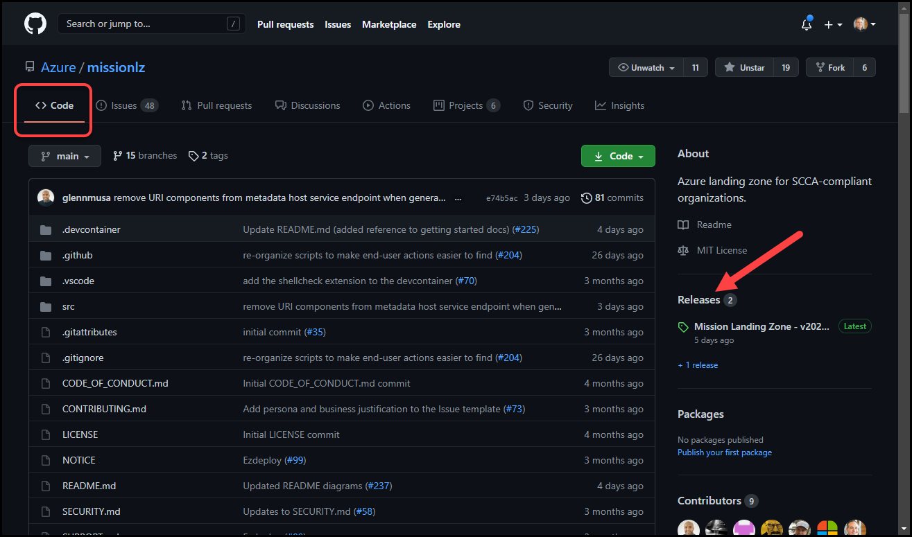
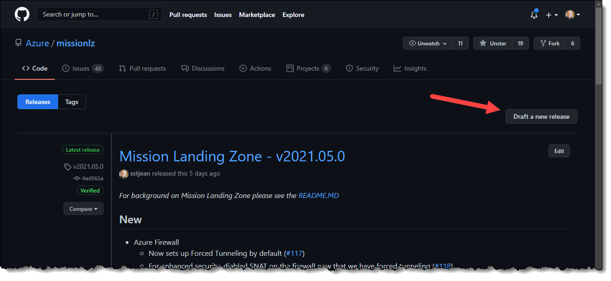
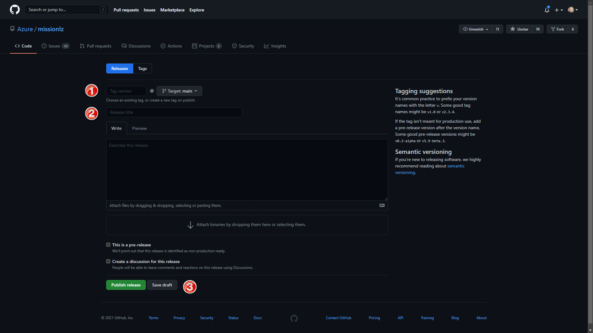
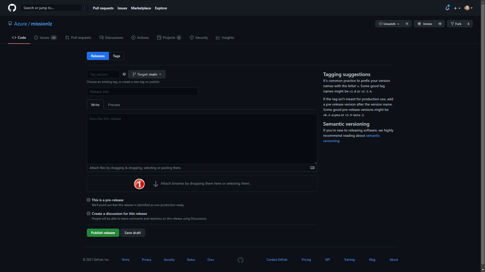

# How to create an MLZ release

## Overview

Creating an MLZ release is a fairly straight-forward process.  Except for the Release Notes, all of this should be easily automated in the future.

1. Create a new Draft Release

1. Generate a UI container from the current code  and add to the Release

1. Update the Release Notes

1. Publish the Release

## Create a new draft Release

We will start by creating a Draft Release that will apply our Tag and setup the rest of the release process.  We create the draft so we can jump around and add to it without losing any work if we get distracted and our browser closes or machine reboots.

1. On the main Mission Landing Zone project page in GitHub, click on the _Code_ tab at the top and then click on the _Releases_ label in the right gutter as shown in below.

    <!-- markdownlint-disable MD033 -->
    <!-- allow html for images so that they can be sized -->
    
    <br/><br/>
    <!-- markdownlint-enable MD033 -->

1. On the _Releases_ page, click on the __New release__ button to start a draft release.

    <!-- markdownlint-disable MD033 -->
    <!-- allow html for images so that they can be sized -->
    
    <br/><br/>
    <!-- markdownlint-enable MD033 -->

1. In the _New Release_ page, start by creating a new tag against the current HEAD of Main.  Enter the name of the Tag in the _Tag Version_ field (shown at marker 1) in the format ```vYYYY.MM.x``` where:

    - YYYY is the 4 digit year
    - MM is the 2-digit month
    - x is the Revision, an incrementing value starting from zero  

    if the entered tag doesn't already exist, then that tag will be applied to HEAD when you click __Save draft__ or __Publish release__.  

    Example tag: the May 2021 release would be tagged ```v2021.05.0```.  

    <!-- markdownlint-disable MD033 -->
    <!-- allow html for images so that they can be sized -->
    
    <br/><br/>
    <!-- markdownlint-enable MD033 -->

1. In the _Release title_ field (shown at marker 2), enter a short name for the release.  This will be shown on the main _Code_ tab in the _Releases_ section.  The format we have been using is: _Mission Landing Zone - {tag value}_.  

    Example title: the May 2021 title would be __Mission Landing Zone - v2021.05.0__.

1. Click on the __Save draft__ button (shown at marker 3) to set your tag and save your title.  Now you can work on building out the release artifacts from that tag.

## Generate a UI container from the current code and add to the Release

Now that we have our Draft Release, we need to generate the Docker Container Image of the MLZ UI so we can add it to the files section of the release.  In the future, we will also need to create a second container for the MLZ CLI installer which will make it easier for users to deploy into an air-gapped Azure cloud.

1. Checkout the tagged code version
1. Run the ```export_docker.sh``` script to create the UI container zip file.

    ```BASH
    cd src/scripts/docker
    ./export_docker.sh
    ```

1. Rename the ```mlz.zip``` file to ```mlz_{release tag}.zip```, replacing the periods with underscores.  For example, the May 2021 release has a tag of ```v2021.05.0```, so the zip file would be named ```mlz_v2021_05_0.zip```

1. Return to the _Draft Release_ page and add the zip file to the release using the _Attach binaries by dropping them here or selecting them_ field (shown at marker 1).


    <!-- markdownlint-disable MD033 -->
    <!-- allow html for images so that they can be sized -->
    
    <br/><br/>
    <!-- markdownlint-enable MD033 -->

## Update the Release Notes

The Release Notes have been following an arbitrary, de-facto standard format.  Feel free to adjust as the situation requires.

The format used so far has been:  

*For background on Mission Landing Zone please see the [README.MD](https://github.com/Azure/missionlz#readme)*

## New  

> _(break down of new stuff by azure service / mlz tier affected)_

- Azure Firewall
  - Now sets up Forced Tunneling by default (#117)
  > _(for each entry, try to link it to the appropriate Issue for more context)_
  - For enhanced security, diabled SNAT on the firewall now that we have forced tunneling (#118)
  - For enhanced security, added a firewall policy that sets Threat Intelligence = Alert. (#119)
- Azure Bastion
  - _(...)_

- Workloads (Tier 3)  
  - _(...)_

- _(...)_

## Features prior to this Release

> _(break down of new stuff by azure service / mlz tier affected)_

- Hub and spoke networking
  - Azure Firewall Premium is deployed in clouds where it is generally available, with Azure Firewall Standard deployed in clouds where Premium is not generally available.  
- Discoverability and usability via user interface
- CI/CD automation
- Guidance on Management Groups, Azure Policy, and Blueprints


## Tested Clouds 
#### (_CLI and UI unless otherwise noted_)
- Azure Commercial :heavy_check_mark:
  - Azure Firewall Premium deployed
- Azure Government :heavy_check_mark:
  - Azure Firewall Standard deployed
- Azure Government Secret :question:
  - Deployment testing in progress (will update status)
- Azure Government Top Secret :question:
  - Deployment testing in progress (will update status)
 
## Files

- mlz_v2021_05_0.zip - Docker image of MLZ UI for air-gapped cloud deployments
  - deployment will also need source code files
  - see [Step-by-step Azure Air Gapped Installation](https://github.com/Azure/missionlz/blob/4ad561adf3966aa8efc7d80607d46afb3a4dde7a/src/docs/ui-deployment.md#step-by-step-azure-air-gapped-installation) 


## Publish the Release
